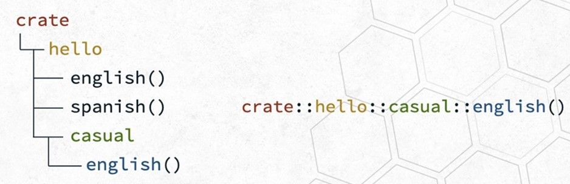

# 01.03 to 01.05

In this package we will write the content of the videos:

## `1.3 Defining Modules` inline modules
To define modules in the same file just type `mod [name_of_module]` and declare the functions inside it. You can also declare modules inside modules. Check the `main.rs` file to learn more.

## `1.4 Absolute vs. relative path` absolute and relative paths
Paths is the way we reference items within the module system so we can bring them to our program. Paths can be relatives or absolute.

To understand paths a little bit better check out the `main.rs` file

### **Relative Paths**
Relatives paths start from within the current module. You can recognize this paths because instead of using `crate` to start from the root crate, you will have identifiers like:
- `self` to access an element in the current module (optional)
```rust
// `self` Example
fn foo() {}
fn bar() {
    self::foo()
    foo(); // its also valid
}
```

- `super` to access an element in the parent module
```rust
// `super` example
mod a {
    pub fn foo() {}
}
mod b {
    pub fn foo() {
        super::a::foo(); // call a's foo function
    }
}
```

>[!Note] It is possible to use `super` multiple times: `super::super::foo`

### **Absolute Paths**
The modules represent a hierarchy that start from the root crate (`src/main.rs` in this case) and this why it is called *absolute* path, because the path starts from the root crate. You can recognize this path because it will contain the identifier `crate`.


So if I wan to refer to the casual `english` function I will do it by writing:
```rust
crate::hello::casual::english()
```

>[!Note] the root crate `src/main.rs` or `src/lib.rs` will be reference as `crate`

>[!Note] Note that `::` is used to separate layers

### **Relative vs Absolute paths**
Barron Stone (The Instructor of the class) point out that even though absolute paths look tempting to use them everywhere there is a downside. In the case you update the name of a module then you will have to update more paths in order to make the code work becoming a "maintenance nightmare" 

## `1.5 Public modules` privacy in rust

Rules:
- All items in a module are private by default
- Parent modules *cannot* use private items in a child node
- Child modules *can* use items from parent modules even if they are private
- You can access private items within the same module.